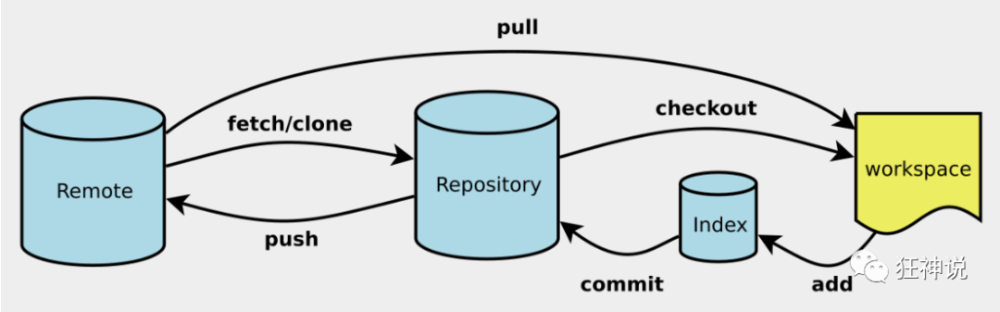
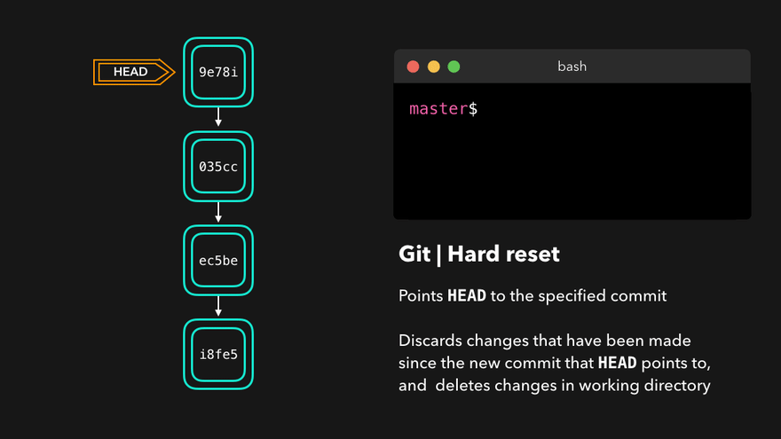

# git 笔记

## 查看配置文件

```
git config -l
```

## 设置用户名与邮箱（用户标识，必要）

```
git config --global user.name "kuangshen"  名称

git config --global user.email 24736743@qq.com   邮箱
```

# git 基本知识




# git 本地仓库搭建 (重要)

## 1.创建全新仓库 \*\*\*

```
#在当前目录新建一个git代码库
$git init
```

## 2.克隆远程仓库 \*\*\*

```
git clone [] 例//git@github.com:MG280010/hwj.git
```

## 3.查看文件状态 \*\*\*

```
#查看指定文件的状态
git status [filename]

#所有文件
git status
```

# 4.将我们工作区的代码放进本地仓库 \*\*\*

```
# git add .
添加所有文件到暂存区
git add test.txt
相等于
touch test.txt

# git commit -m ""
提交暂存区的内容进入本地仓库
# -m 提交信息
```


# git 分支

创建分支 可以使我们在`同一个远程库中`，进行`多个版本`的开发，并不会破坏`已有`的代码 通过创建新的分支，开发人员可以及进行`独立安全`的工作，并在需要时`合并`到主分支  
利于帮助`团队合作`，避免发生`代码冲突`和错误，提高代码质量

## 1.列出本地所有分支

```
git branch
```

## 2.列出远程所有分支

```
git branch -r
```

## 3.新建分支 \*\*\*

```
git branch [分支名称]
# 新建一个分支 并停留在当前分支

git checkout -b [分支名称]
# 新建分支 并切换分支
```

## 4.合并指定分支到当前分支

一旦某分支有了`独立内容`，你终究希望希望它`合并到你的主分支`，可以使用以下命令

```
git merge [branch]

例：git merge a 将a分支 合并到 master分支中
```


## 5.删除分支

```
git branch -d [branchname]
```

## 6.为当前分支添加标签

```
git tag v1.0
```

# 通过 git 将代码提交到 github

# pull (拉取)

直译过来就是 `拉`  
远程仓库有了`更新  `  
为了保持本地与远程代码`同步 `  
就需要把`远程的代码拉到`本地

```
git pull origin master
```

# push (提交)

相反于 `pull`  
我们需要将本地代码`推到远程的仓库`

```
git push origin master
```

# remote (连接)

```
git remote -v  显示所有远程仓库

git remote show [remote]  显示某个仓库的名称

git remote add [shortname] [url]
添加远程版本库
shortname 为本地版本库

其他相关命令
git remote rm name
#删除远程仓库

git remote rename old-name new-name
#修改仓库名
```

```
提交到github 仓库
例
git remote add origin git@github.com:MG280010/hwj.gitgit@github.com:MG280010/hwj.git
```

# git 查看提交历史

```
git log
查看历史提交记录

额外:
后面加上
--oneline 简化记录
--graph 查看什么时候出现分支
--reverse 逆向显示所有日志

git blame<file>
以列表形式查看指定文件的历史修改提交记录
```

## stash

## git 储藏

## 将一个为提交的修改存储在本地。用于后续恢复当前工作目录

```
git stash
是本地的 不会通过git push 上传上git server上

建议使用 git stash save ""
可以用于记录版本

重新使用
git bash pop
恢复之前缓存的工作目录

查看现有stash
git stash list

移除stash 后面可跟上stash名字
git stash drop

```

## reset

## 后悔药

```
git reset [HEAD]
将暂存区的东西清除

用于重置暂存区的文件与上一次保持一致，工作区文件内容保持不变

git reset --soft HEAD~3   # 回退上上上一个版本

```

```
其他相关代码
git reflog

列出所有commit 记录
```


## 可以看到 reset 前的记录

```
git reset <commit ID>

回到reset 前的记录啦！
```

## git reset

## reset 后 不管是工作目錄以及暫存區的檔案都會丟掉



## 无用的代码增加了

```
cat README.md
查看README.md中的内容
```

# 这边更建议使用 git revert

### 保留先前提交的更改历史记录 避免删除历史记录

```
用法：
git revert <commit> (如分支名或commit id)
```

```
cd /进入某文件
cd .. /返回上一层
ls /查看该层存在内容文件
```

# 服务器上搭建 git 仓库

## 安装 git

```
sudo apt-get install  git
或
sudo apt install git
```

## 创建 空的 git 仓库 ，

### 进入你想要的创建 git 仓库 de 目录

```
cd 进入
ls 列出
mkdir myrep.git

例
cd /home 这里选择在/home目录下创建
mkdir gitproject 文件夹名根据实际项目来起
```

## 文件夹 创建裸仓库

```
cd gitproject 创建新的裸仓库
git init --bare gitproject.git

--bare 指创建一个裸仓库
```

## 配置

### 设置权限 确保 git 仓库所在的目录和文件具有正确的权限

```
chown -R git:git gitproject.git

例
sudo chown -R www-data:www-data myrepo.git
```

## 克隆 git 仓库

```
git clone <username>@<server_ip>:目录名项目名

username 用户名
server_ip 服务器 ip
```

# 持续更新。。。
